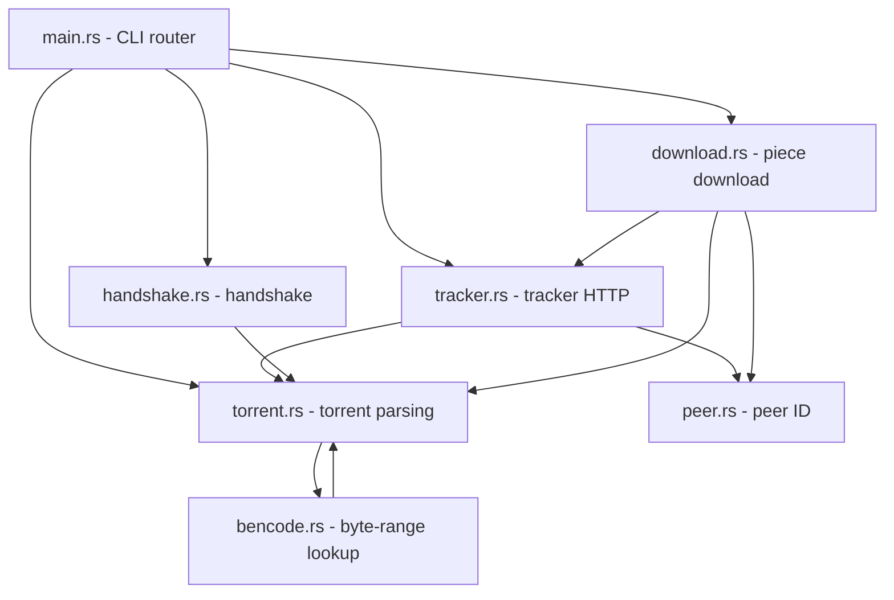

# Rust BitTorrent Client

A BitTorrent client built from scratch in Rust. Implements:

- `.torrent` parsing
- Tracker communication
- Peer handshake
- Piece download and verification

> Originally inspired by Codecrafters, now extended as a standalone project.

## Run

```bash
cargo run -- info sample.torrent
cargo run -- peers sample.torrent
cargo run -- handshake sample.torrent 127.0.0.1:6881
cargo run -- download -o output.bin sample.torrent
```

```bash
cargo build --release
./target/release/bittorrent-rust-client info path/to/file.torrent
```

## Project Structure

- `src/main.rs` – CLI entry point
- `src/bencode.rs` – Low-level bencode byte-range lookup
- `src/torrent.rs` – Torrent file parsing, info hash, and piece hashes
- `src/tracker.rs` – Tracker HTTP requests and peer list parsing
- `src/peer.rs` – Peer ID generation
- `src/handshake.rs` – BitTorrent peer handshake
- `src/download.rs` – Piece download and file assembly



## Dependencies

- serde, serde_json – JSON and bencode decoding
- reqwest – HTTP tracker communication
- sha1, hex – info hash and piece verification
- anyhow – error handling
- rand – peer ID generation

## Author

Aayushman00 – https://github.com/Aayushman00

## License

MIT License. See [LICENSE](LICENSE).
